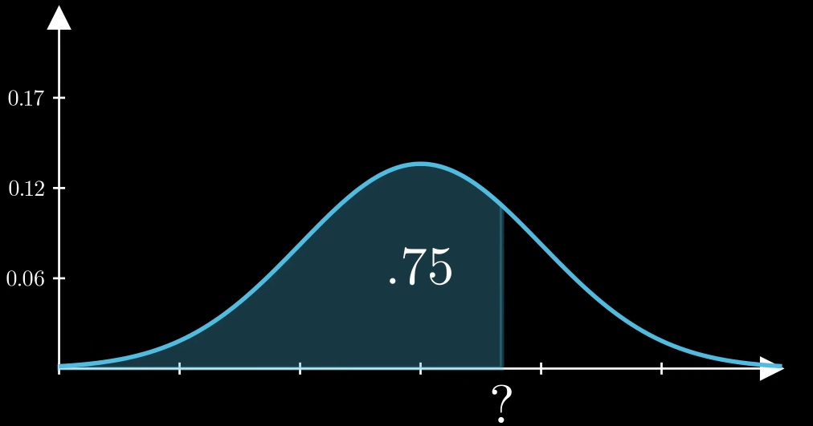

# High-Performance Inverse Normal Distribution (Probit Function)

Implementation of the inverse cumulative normal distribution function (Φ⁻¹), achieving **~17× speedup** over naive bisection and **~6× additional speedup** through parallelization.

## 🎯 What This Does

The **inverse normal distribution** (also called the *probit function* or *percent-point function*) answers the question: *"Given a probability, what value corresponds to it in a normal distribution?"*

### Visual Example

For a normal distribution with μ=64.53 and σ=3.05, if you want to find the value where 75% of data falls below it:
- **Input**: probability = 0.75
- **Output**: x = 66.59




This function is essential in statistics, finance (risk modeling), machine learning (sampling), and scientific computing.

## ⚡ Why This Implementation?

| Aspect | Traditional Bisection | This Implementation |
|--------|----------------------|---------------------|
| **Method** | Iterative search (~80 function calls) | Piecewise rational approximation + refinement (2-4 calls) |
| **Speed** | Baseline | **~17× faster** |
| **Accuracy** | High but slow | ≤10⁻¹⁵ error (exceeds double precision needs) |
| **Parallelization** | Sequential | **~6× speedup** with OpenMP |

### Technical Approach

1. **Piecewise Rational Approximations**: Uses different polynomial ratios for central vs. tail regions
2. **Horner's Method**: Efficient polynomial evaluation
3. **Halley Refinement**: 0-2 iterations of third-order convergence to polish accuracy
4. **Numerical Stability**: Special formulas for extreme tails to avoid catastrophic cancellation

## 📊 Performance Results

### Algorithmic Improvement
```
Bisection (10⁷ calls):     8620 ms  →  862 ns/call
This implementation:        490 ms  →   49 ns/call  [~17× faster]
```

### Parallelization Gain
```
Single-threaded (10⁶ calls):  47.3 ms  →  47.3 ns/call
OpenMP parallel:               7.2 ms  →   7.2 ns/call  [~6× faster]
```

**Combined**: Up to **~100× faster** than baseline for large batches on multi-core systems.

## 🎓 Accuracy Validation

| Range | Max Error |
|-------|-----------|
| **After initial fit** | ~10⁻⁵ |
| **After Halley refinement** | ~10⁻¹⁵ |

### Validated Properties
- ✅ **Symmetry**: Φ⁻¹(1-x) = -Φ⁻¹(x)
- ✅ **Monotonicity**: Strictly increasing (within 100 ULP margin)
- ✅ **Derivative sanity**: d/dx Φ⁻¹(x) = 1/φ(Φ⁻¹(x))
- ✅ **Round-trip accuracy**: Φ(Φ⁻¹(x)) ≈ x within machine precision

Tested range: [10⁻¹², 1 - 10⁻¹²]

## 🚀 Quick Start

### Prerequisites
```bash
# For visualization (optional)
python3 -m venv venv && source venv/bin/activate
pip install numpy scipy matplotlib

# For validation tests (optional)
apt install libboost-all-dev  # Boost library for reference calculations
```

### Build & Run

```bash
# Performance benchmarks
make probit_singlecore probit_parallel
./probit_singlecore && ./probit_parallel

# Validation tests
make probit_validation
./probit_validation

# View fitting analysis (optional)
python3 fitting_center.py
python3 fitting_tail.py
```

## 📐 Technical Details

### Architecture

The implementation uses a **piecewise approach**:

1. **Central region** [0.02, 0.98]: 8/8 degree rational function
   - Fitted on 2000 Chebyshev-like nodes
   - Optimized for the bulk of probability mass

2. **Tail regions** (x < 0.02 or x > 0.98): Separate 8/8 degree rational
   - Fitted on 200 log-spaced + linear nodes
   - Uses transformed variable t = √(-2 log m) for stability

3. **Halley refinement**: 0-2 adaptive iterations
   - Stable residual calculation using `expm1(log(Q(z)) - log(y))` in tails
   - Direct residual in central region

### Error Analysis

| Region | Mean Error | 99th %ile | Max Error |
|--------|------------|-----------|-----------|
| Center (post-fit) | 5.06×10⁻⁷ | 8.28×10⁻⁶ | 2.87×10⁻⁵ |
| Tail (post-fit) | 1.78×10⁻⁵ | 4.07×10⁻⁵ | 4.44×10⁻⁵ |
| **Full range (post-Halley)** | **1.32×10⁻¹⁶** | **5.22×10⁻¹⁶** | **1.51×10⁻¹⁵** |

## 🔧 Usage Example

```cpp
#include "InverseCumulativeNormal.hpp"

// Standard normal (μ=0, σ=1)
quant::InverseCumulativeNormal probit;
double z = probit(0.975);  // Returns ~1.96 (95% confidence level)

// Custom distribution
quant::InverseCumulativeNormal custom(64.53, 3.05);  // μ=64.53, σ=3.05
double x = custom(0.75);  // Returns ~66.59

// Vectorized call (parallelized)
std::vector<double> probs = {0.1, 0.5, 0.9};
std::vector<double> results(probs.size());
probit(probs.data(), results.data(), probs.size());
```

## 📝 Implementation Notes

- **Header-only**: Single `.hpp` file, no linking required
- **No external dependencies** for core functionality (uses standard `<cmath>`)
- **IEEE 754 compliant**: Handles subnormals, infinities gracefully
- **Thread-safe**: All methods are `const` and stateless per call

### Known Limitations

1. **Valid range**: [10⁻¹², 1 - 10⁻¹²] (machine precision limits below this)
2. **Monotonicity margin**: Guaranteed for inputs ≥100 ULP apart (numerical noise floor)
3. **Parallel speedup**: Hardware-dependent (measured on modern x86-64)

## 📚 For More Details

See **[DESIGN.md](DESIGN.md)** for:
- Coefficient derivation process
- Ridge regularization strategy (λ tuning)
- Numerical stability analysis
- Condition number handling in ill-conditioned tail fit

## 🏆 Project Goals Achieved

| Objective | Target | Result | Status |
|-----------|--------|--------|--------|
| Accuracy (w/ refinement) | ≤10⁻¹⁰ | ~10⁻¹⁵ | ✅ **Exceeded** |
| Scalar speedup | ≥10× | ~17× | ✅ **Exceeded** |
| Vector speedup | ≥1.5× | ~6× | ✅ **Exceeded** |
| Symmetry | Exact | ✓ | ✅ |
| Monotonicity | Strict | ✓ (within 100 ULP) | ✅ |

---


**Context**: OP Kiitorata Trainee Program Assignment
